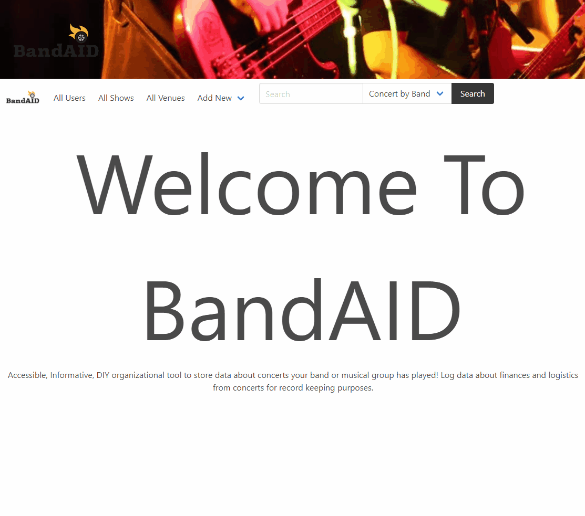

# BandAid

## Description

BandAid is a resource and tool for musicians. It allows a user to store information about other bands, shows and the venues they play at for later reference. This was a team project for experience using a number of tehnologies including both front end and back end languages. This app is still under development and we hope to expand on it in the future.

## Table of Contents

- [Usage](#usage)
- [Credits](#credits)
- [License](#license)

## Usage

To use this app simply visit: https://fierce-beach-33317.herokuapp.com/  
An example of the deployed app can be seen in the screenshot below:

## Credits

Technology used:

- VSCode
- Heroku
- JawsDB
- MySQL
- NodeJS
- ExpressJS
- DotENV
- Bulma

Collaborators:

- Aaron Mendoza
- Lacey Pape
- Taylor "Bo" Smith
- TJ Courey

## License

MIT License

Copyright (c) [2021]

Permission is hereby granted, free of charge, to any person obtaining a copy
of this software and associated documentation files (the "Software"), to deal
in the Software without restriction, including without limitation the rights
to use, copy, modify, merge, publish, distribute, sublicense, and/or sell
copies of the Software, and to permit persons to whom the Software is
furnished to do so, subject to the following conditions:

The above copyright notice and this permission notice shall be included in all
copies or substantial portions of the Software.

THE SOFTWARE IS PROVIDED "AS IS", WITHOUT WARRANTY OF ANY KIND, EXPRESS OR
IMPLIED, INCLUDING BUT NOT LIMITED TO THE WARRANTIES OF MERCHANTABILITY,
FITNESS FOR A PARTICULAR PURPOSE AND NONINFRINGEMENT. IN NO EVENT SHALL THE
AUTHORS OR COPYRIGHT HOLDERS BE LIABLE FOR ANY CLAIM, DAMAGES OR OTHER
LIABILITY, WHETHER IN AN ACTION OF CONTRACT, TORT OR OTHERWISE, ARISING FROM,
OUT OF OR IN CONNECTION WITH THE SOFTWARE OR THE USE OR OTHER DEALINGS IN THE
SOFTWARE.

## Badges

  

## Features

- Ability to add User, Concert, and Venue as well as storing that info on a remote database
- Ability to view all Users, Concerts, and Venues
- Search for Users, Concerts, and Venues
- Pregenrated information for showing functionality before use.
- Modern U/I
- Premade models for easy expandability

## How to Contribute

No contribution necessary but feedback is always welcome!
